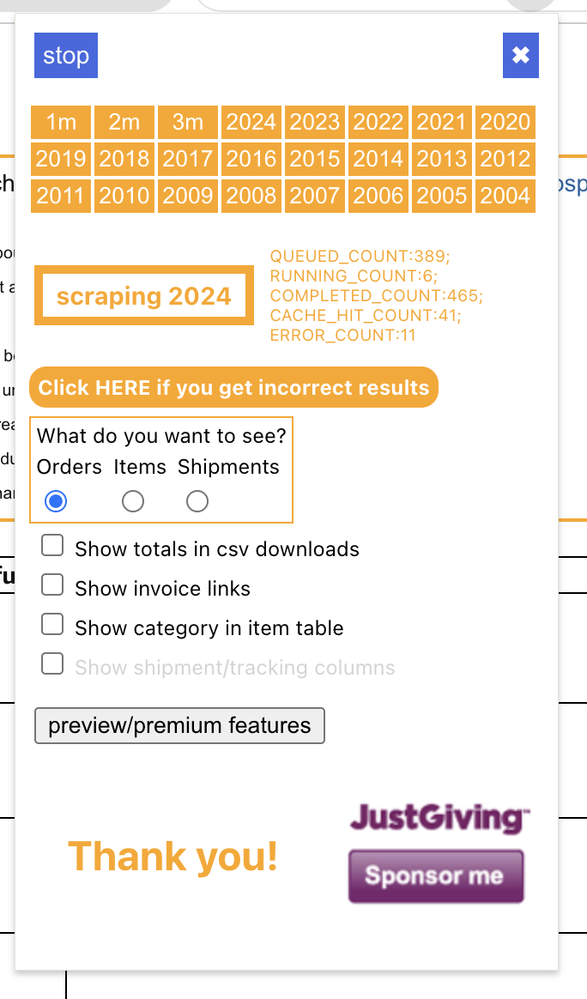

# Enhance and Categorize Amazon Transactions in LunchMoney

[LunchMoney](https://mikebian.co/lunchmoney) is a indie-developed personal finance application. I spend a lot on Amazon, and always thought it would be neat to break open the massive black bucket of money that's funneled into Amazon to understand what categories of spending it represents.

The trick is, Amazon doesn't have an order export. [There's a sneaky extension](https://github.com/philipmulcahy/azad) that allows you to export your orders to a CSV file. This tool ingests that CSV and categorizes your Amazon transactions in Lunch Money.

However, in order to match orders to transactions in Lunch Money, you have to match orders not items, which eliminates a clear 1:1
mapping between transaction and category. To solve this, we pipe the list of items to OpenAI and ask it to categorize the items
based on the categories available in your LunchMoney account.

## Features

- Marked as gift if recipient is not the owner name passed to the CLI
- GPT-4o-mini is used for transaction categorization. Be sure to add a clear description to categories!
- Summary of items purchased and order number is added to the transaction notes.

## Setup

`mise install` (if you don't have bun) and `bun install`.

## Usage

1. Use the [amazon order scraper](https://github.com/philipmulcahy/azad) to pull your amazon history.
   1. You want order view, not items, so we can match up charges to orders.
2. Get a lunch money API key. Run `cp .env-example .env` and add your API key to `.env`, or input it directly via the command line.

```shell
Usage: amazon-lunchmoney [options]

Options:
  -v, --verbose                      output verbose logs
  -f, --file <path>                  amazon history file
  -k --lunch-money-key <key>         lunch money api key
  -m --mapping-file <path>           category mapping file
  -d, --dry-run                      dry run mode (default: false)
  -n, --owner-name <name>            the name of the owner of the account, used to determine if a order is a gift
  -c, --default-category <category>  default category
  -h, --help                         display help for command
```

Here's an example command:

```shell
bun run.ts -f '~/Downloads/amazon_order_history.csv' -c Shopping -n "Michael Bianco"
```

You'll probably want to dry run it first, to setup missing categories.

```shell
bun run.ts -f '~/Downloads/amazon_order_history.csv' -c Shopping -n "Michael Bianco" -d
```

### OpenAI Costs

The most amazing thing about this approach is it costs effectively nothing.

In order to test the system, I ran this multiple times in dry-run mode against my full-year amazon transactions (~200). It consumed about 200k tokens, which is below the minimum billing threshold for OpenAI, so running this was free. Amazing.

## Development

Update `run.ts` and run it.

Or open up a repl and play around:

```javascript
import { LunchMoney } from "lunch-money";
let lunchMoneyKey = process.env.LUNCH_MONEY_API_KEY;
let client = new LunchMoney({ token: lunchMoneyKey });

import { readCSV } from "./util.js";
let allAmazonTransactions = await readCSV("path");
```

You can log loudly as well:

```shell
LOG_LEVEL=debug bun run.ts -f '~/Downloads/amazon_order_history.csv' -c Shopping -n "Michael Bianco"
```

## TODO

- [ ] Indicate which purchases are HSA/FSA eligible and maybe generate receipt? This would need to be added to the scraper
- [ ] publish on npm
- [ ] Should match up refunds and categorize them appropriately
